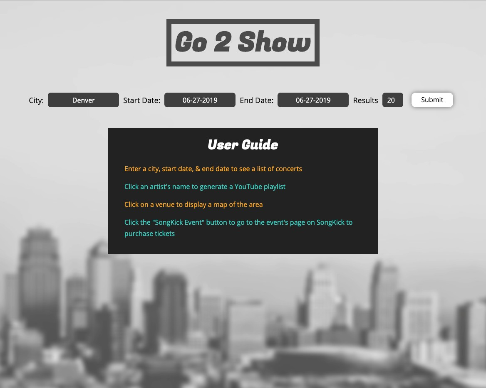
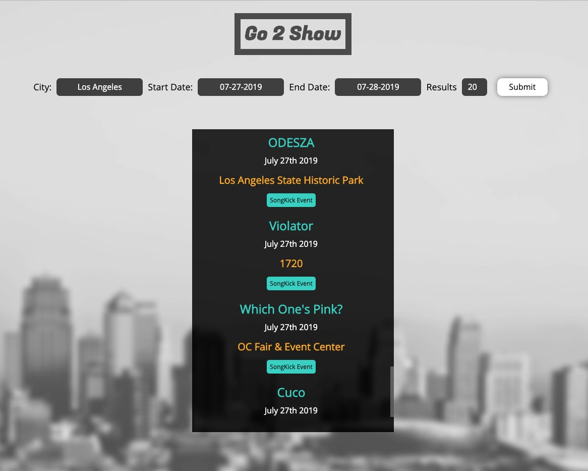
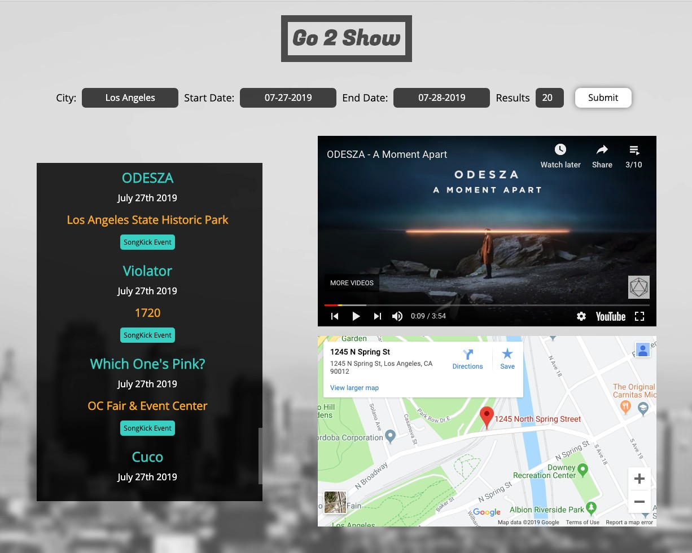

# Go 2 Show

Link to App: https://bengrabowski.github.io/Go-2-Show/

## Go 2 Show is a web based application that uses SongKick, Youtube, and Google Maps APIs to help users discover upcoming live music events.

Users can search for concerts in a given city during a specific period of time. Clicking on an artist will generate a YouTube playlist based on a search for the artist's name. Clicking on the venue pulls up a map of the area and users can get directions via Google Maps. Users can also click the "Songkick Events" link to go to the Songkick Event page where they can purchase tickets. 

Technology Used:
- HTML
- CSS
- JavaScript
- jQuery

### Home Screen

### Concert Results

### Concerts with YouTube Player and Google Map
